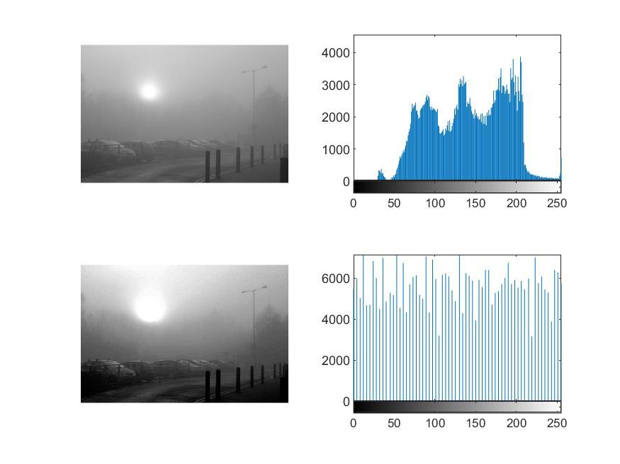

= Histogram Equilization

:imagesDir: images
:stylesDir: stylesheets
:xrefstyle: full
:experimental:
ifdef::env-github[]
:tip-caption: :bulb:
:note-caption: :information_source:
:important-caption: :warning:
:format-caption:
endif::[]
:repoURL: https://github.com/amrut-prabhu/computer-vision/blob/master

== Sample code

* {repoURL}/histogram_equilization/histogram_eq.m[Implementation of algorithm]
* {repoURL}/histogram_equilization/histogram_eq_function.m[Using built-in functions]

== Sample output

.Sample result of the implemented Histogram Equilization function.
